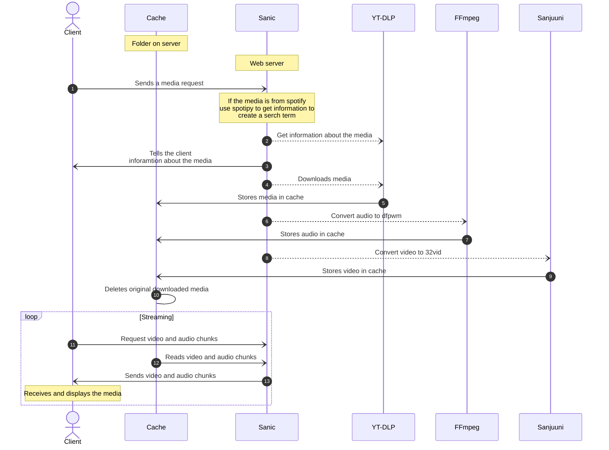

# Home

YouCube is a service for accessing media providers in ComputerCraft, the popular Minecraft mod that allows players to program in-game computers using the Lua programming language. With YouCube, you can easily stream media from your favorite providers, all from the comfort of your in-game computer.

Whether you're looking to listen to music, watch movies, or catch up on the latest TV shows, YouCube has you covered. Simply install YouCube, enter a URL or search term, and start exploring all that YouCube has to offer.

So why wait? Start enjoying the best in media entertainment with YouCube today!

## Examples

<iframe width="560" height="315" src="https://www.youtube.com/embed/bgUDokOr38M" title="YouCube Example 1" frameborder="0" allow="accelerometer; autoplay; clipboard-write; encrypted-media; gyroscope; picture-in-picture; web-share" allowfullscreen></iframe>

<iframe width="560" height="315" src="https://www.youtube.com/embed/dz96Y4mo0GI" title="YouCube Example 2" frameborder="0" allow="accelerometer; autoplay; clipboard-write; encrypted-media; gyroscope; picture-in-picture; web-share" allowfullscreen></iframe>

## How it works

<!---
add this when Mermaid has been upgraded
https://github.com/squidfunk/mkdocs-material/issues/5251

    box rgb(33,66,99) Server
        participant Sanic
        participant YT-DLP
        participant Cache
        participant FFmpeg
        participant Sanjuuni
    end
-->

